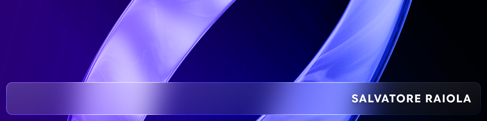

<div align="center">
  


# Hi, I'm Salvatore 


[](https://uninacorse.com/)
[](https://www.unina.it/)

</div>

---

## About Me

I'm a Robotics/Automation Engineering Master student at the **Università degli Studi di Napoli Federico II**. I'm part of the **Autonomous System** division of **[UniNa Corse](https://uninacorse.com/)**, the university's official Formula Student racing team, which competes internationally in the Driverless class and has multiple podium finishes to its name.

My project work spans autonomous perception & localization, systems and network programming, software engineering, and control theory — with a growing focus on **SLAM, sensor fusion, and real-time robotics software**.

---

## 🏎️ Currently Building

A **multi-pipeline SLAM stack** for UniNa Corse's driverless race car, benchmarking three parallel approaches to cone-based track localization:

- **Graph SLAM** with an **iSAM2** backend for incremental factor-graph optimization

## Architettura del Sistema

```
┌─────────────────────────────────────────────────────────────┐
│                        I/O THREAD                           │
│  (ROS2 MultiThreadedExecutor — callbacks ROS2)              │
│                                                             │
│   ZED Callback ──┐                                          │
│   LiDAR Callback─┼──► iotofe_landmarks_queue (SPSC)         │
│   Odom Callback ─┘──► iotofe_pose_queue      (SPSC)         │
└─────────────────────────────────────────────────────────────┘
                          │
                          ▼
┌─────────────────────────────────────────────────────────────┐
│               FRONT-END THREAD  (~400 Hz)                   │
│  (pthread POSIX — priorità SCHED_FIFO 80)                   │
│                                                             │
│   • Temporal Sync ZED/LiDAR ↔ Odom (buffer + match)         │
│   • Sensor Fusion ZED + LiDAR (merge frame)                 │
│   • Dead Reckoning (propagazione covarianza EKF-like)       │
│   • Data Association (Mahalanobis + fallback euclideo)      │
│   • Waiting List (soglia N osservazioni prima di mappare)   │
│                                                             │
│   ──► fetobe_queue (SPSC) ──► Back-End                      │
│   ◄── betofe_updates_queue (SPSC) ◄── Back-End              │
└─────────────────────────────────────────────────────────────┘
                          │
                          ▼
┌─────────────────────────────────────────────────────────────┐
│               BACK-END THREAD  (~40 Hz)                     │
│  (pthread POSIX — priorità SCHED_FIFO 40)                   │
│                                                             │
│   • iSAM2 (fattorizzazione Cholesky, relinearize skip)      │
│   • BetweenFactor (odometria con Huber robust noise)        │
│   • BearingRangeFactor (ZED σ_b=0.20, σ_r=0.80)             │
│   • BearingRangeFactor (LiDAR σ_b=0.02, σ_r=0.05)           │
│   • Estrazione covarianza marginale pose + landmarks        │
│                                                             │
│   ──► betofe_updates_queue (SPSC) ──► Front-End             │
│   ──► betoio_pose_queue    (SPSC) ──► I/O                   │
│   ──► betoio_landmarks_queue (SPSC) ──► I/O                 │
└─────────────────────────────────────────────────────────────┘
```


## Presentazione del Sistema

<p align="center">
  
</p>

System validation is carried out through **ROS bag playback in Foxglove Studio**, with a focus on landmark/cone position estimation, data association stability, camera–LiDAR extrinsic calibration, and loop-closure quality.

---

## 🛠️ Tech Stack

**Languages**


**Robotics & Autonomous Systems**


**Backend, Networking & Middleware**


**Software Engineering**


**Systems & Control**


---

## 📌 Featured Projects

| Repository | Description | Stack |
|---|---|---|
| **[ROS2_Practice_UninaCorse_AS](https://github.com/salvatore202/ROS2_Practice_UninaCorse_AS)** | ROS 2 foundations and hands-on exercises built for the Autonomous System division of UniNa Corse, ahead of the team's driverless perception & SLAM stack. | `Python` `ROS 2` |
| **[GLAM](https://github.com/salvatore202/GLAM)** | Full-lifecycle OOP system built for a Software Engineering exam: UML modeling in Visual Paradigm, BCE architecture, DAO-based MySQL persistence, and a JUnit 5 test suite. | `Java` `MySQL` `JUnit 5` `UML` |
| **[Real-Time-filtering](https://github.com/salvatore202/Real-Time-filtering)** | Real-time signal filtering assignment for the Real-Time Systems course, focused on deterministic execution and timing guarantees. | `C` `Python` `Shell` |
| **[Network-programming-and-middellware-technologies](https://github.com/salvatore202/Network-programming-and-middellware-technologies)** | Distributed-systems exercises: TCP/UDP sockets, gRPC services, STOMP/MOM messaging over ActiveMQ, and a Flask + MongoDB backend. | `Python` `gRPC` `Flask` `MongoDB` |
| **[Uninformed-Search-Algorithms-Analysis](https://github.com/salvatore202/Uninformed-Search-Algorithms-Analysis)** | Comparative analysis of BFS, DFS, Dijkstra, DLS and IDS — completeness, complexity, runtime and memory profiling on a real road-network graph. | `Python` |
| **[Advanced-and-Multivariable-Control](https://github.com/salvatore202/Advanced-and-Multivariable-Control)** | Exercises and exam material for the Advanced & Multivariable Control course. | `MATLAB` |
| **[Cpp](https://github.com/salvatore202/Cpp)** | OOP and data-structure fundamentals — linked lists, stacks, queues, priority queues, and classic algorithm exercises. | `C++` |
| **[Queens](https://github.com/salvatore202/Queens)** | Two algorithmic solutions to the N-Queens problem (array-based and stack/list-based). | `C++` |

---

## 📊 GitHub Stats

<p align="center">
  
  
</p>

---

## 📫 Let's Connect

- 📧 Email: `salvatoreraiola2002@gmail.com`
- 💼 LinkedIn: `https://it.linkedin.com/in/salvatore-raiola-0b7329363`

> *(placeholders — swap in your real contact details)*

---

<div align="center">
<sub>Autonomous systems, robotics, and clean engineering.</sub>
</div>
